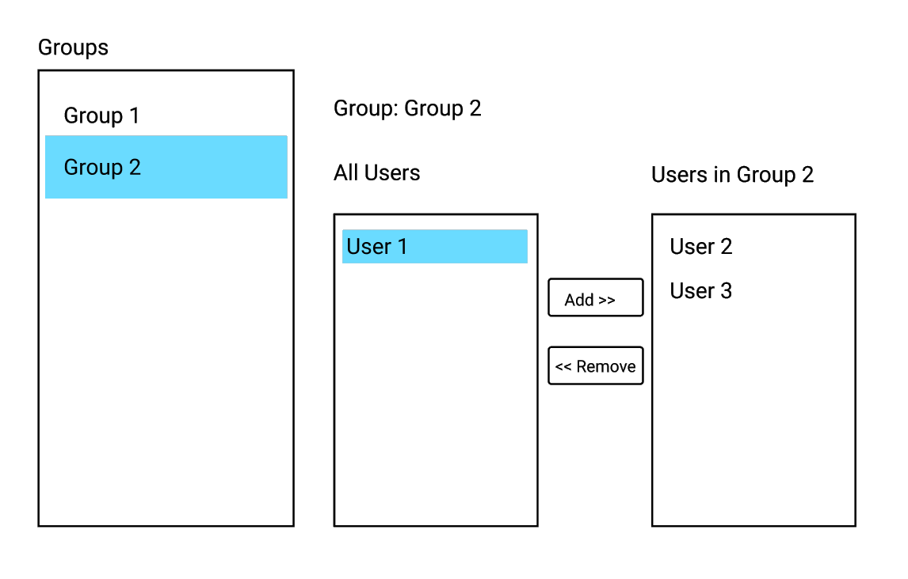

# WhoCo Takehome

Implement a user management app where user can be added and removed to groups. This can be built in either Angular (`/frontend`) or React (`/frontend-react`).

Expected time budget: ~6-8 hours

## Backend

The backend is pre-configured with all the models and APIs needed to fulfill the frontend requirements. There are no additional requirements here.

Although feel free to modify the data model (with or without UI). Examples:
- Best-friend relationships between users
- User's favorite group

Note, do not implement authentication, the backend GraphQl endpoint is unprotected.

## Frontend

General
- Use strict typing with Typescript (no `any`, etc.), the compiler is set to enforce that
- Apply component hierarchy principles and communication patterns

### Functional

- List all user groups
- List all users in the group when a group is selected
- Add / remove users to the selected group

### UX

Make any user experience that you see fit for the use cases. As an example though this is a potential option:

### UI

The interface does not have to be pretty. Use a 3rd party library to enhance the interface if desired.
